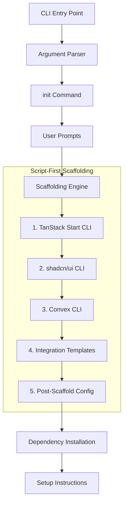

# Area 1: CLI Tool

## Overview

This area covers the r9stack CLI tool itself—the npm package that users install globally and run to scaffold new projects. It defines HOW scaffolding happens, independent of WHAT gets generated.

## Goals

- Provide a simple, single-command experience: `r9stack init`
- Leverage official CLI tools for each technology (script-first approach)
- Apply minimal integration templates only for glue code
- Guide users through any manual setup steps with clear instructions and links
- Follow TypeScript best practices for CLI tooling

## Architecture

## Task Groups

| ID | Name | Description | Status |
|----|------|-------------|--------|
| 1.1 | [Package Setup](1.1-package-setup.md) | npm package config, TypeScript, build pipeline | 🔵 Planned |
| 1.2 | [CLI Commands](1.2-cli-commands.md) | Argument parsing, init command, user prompts | 🔵 Planned |
| 1.3 | [Scaffolding Engine](1.3-scaffolding-engine.md) | CLI orchestration, integration templates, configuration | 🔵 Planned |

## Key Decisions

- **Script-first approach** – Execute official CLIs (TanStack Start, shadcn, Convex) rather than duplicating their work with templates
- **Integration templates only** – Templates are used only for glue code that connects technologies (auth, payments)
- **Commander.js** for CLI argument parsing (widely used, well-documented)
- **TypeScript with ESM** for modern module system compatibility
- **Version sync pattern** from flight-rules: sync package.json version to template files on release

## CLI Tool Execution Order (V1)

1. `npm create @tanstack/start@latest` – Creates base React project
2. `npx shadcn@latest init` – Adds Tailwind and component library
3. `npx convex init` – Adds Convex backend layer
4. Apply integration templates – WorkOS auth
5. Post-scaffold configuration – Wire everything together

> **Note:** Stripe payment integration is deferred to post-V1.
