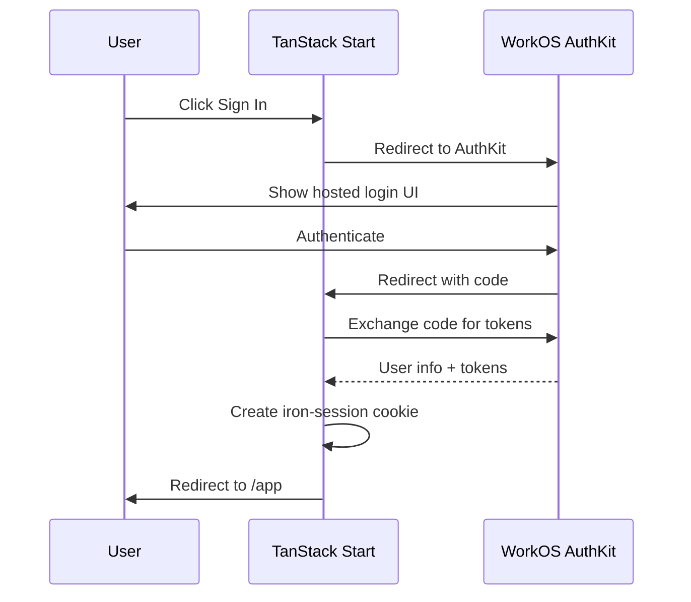

# 2.3 Auth Integration

## Overview

Integrate WorkOS authentication with session management. WorkOS AuthKit handles the hosted login UI; iron-session manages encrypted cookie sessions on the server.

## Key Decisions (Validated)

| Decision | Choice | Rationale |
|----------|--------|-----------|
| WorkOS Product | **AuthKit** | Hosted login UI, handles email/password + social logins |
| Session Library | **iron-session** | Encrypted httpOnly cookies, SSR-compatible |
| Token Storage | **httpOnly cookies** | Secure, sent automatically with requests |
| Protected Routes | **Server-side redirect** | No loading flicker, auth checked in beforeLoad |

## Dependencies

```bash
npm install @workos-inc/node iron-session
```

> **Note:** The WorkOS add-on may install `@workos-inc/node`. iron-session is always added by r9stack.

## Authentication Flow (Validated)



---

## 2.3.1 Auth File Structure (Validated)

**Goal:** Document the target auth file structure.

```
src/lib/
├── auth.ts           # Shared types (User, SessionData)
├── auth-client.ts    # Client-side context and hooks
└── auth-server.ts    # Server-side session management
```

### auth.ts (Types)

```typescript
export interface User {
  id: string
  email: string
  firstName: string | null
  lastName: string | null
  profilePictureUrl: string | null
}

export interface SessionData {
  user?: User
  accessToken?: string
  refreshToken?: string
  expiresAt?: number
}
```

### auth-client.ts (Client Context)

```typescript
export interface AuthContextValue {
  user: User | null
  isAuthenticated: boolean
  isLoading: boolean
  signIn: () => void
  signOut: () => void
}

export const AuthContext = createContext<AuthContextValue | null>(null)

export function useAuth(): AuthContextValue {
  const context = useContext(AuthContext)
  if (!context) {
    throw new Error('useAuth must be used within an AuthProvider')
  }
  return context
}
```

### auth-server.ts (Server Functions)

Uses TanStack Start server functions with iron-session:

```typescript
import { createServerFn } from '@tanstack/react-start'
import { getIronSession } from 'iron-session'
import { WorkOS } from '@workos-inc/node'

const sessionOptions = {
  password: process.env.WORKOS_COOKIE_PASSWORD!,
  cookieName: 'r9_session',
  cookieOptions: {
    secure: process.env.NODE_ENV === 'production',
    httpOnly: true,
    sameSite: 'lax' as const,
  },
}

export const getCurrentUser = createServerFn({ method: 'GET' }).handler(
  async (): Promise<User | null> => {
    // Get session from cookie, return user if valid
  }
)

export const handleAuthCallback = createServerFn({ method: 'GET' }).handler(
  async (ctx: { data: { code: string } }): Promise<User> => {
    // Exchange code for tokens, create session
  }
)
```

**Status:** ✅ Complete (pattern validated in sandbox)

---

## 2.3.2 Environment Variables

**Goal:** Document required environment variables for auth.

```bash
# WorkOS (get from https://dashboard.workos.com)
WORKOS_API_KEY=sk_...
WORKOS_CLIENT_ID=client_...
WORKOS_REDIRECT_URI=http://localhost:3000/auth/callback

# Session secret (generate with: openssl rand -base64 32)
WORKOS_COOKIE_PASSWORD=<32+ character secret>
```

### Variable Sources

| Variable | Where to Get It |
|----------|-----------------|
| WORKOS_API_KEY | WorkOS Dashboard → API Keys |
| WORKOS_CLIENT_ID | WorkOS Dashboard → Your App → Client ID |
| WORKOS_REDIRECT_URI | Set in WorkOS Dashboard + .env |
| WORKOS_COOKIE_PASSWORD | Generate locally |

**Status:** ✅ Complete

---

## 2.3.3 Auth Routes (Validated)

**Goal:** Implement auth flow routes.

### /auth/sign-in

Redirects to WorkOS AuthKit hosted login:

```typescript
export const Route = createFileRoute('/auth/sign-in')({
  beforeLoad: async () => {
    const authUrl = await getAuthUrl()
    throw redirect({ href: authUrl })
  },
  component: SignInPage, // Loading spinner as fallback
})
```

### /auth/callback

Handles OAuth callback, creates session:

```typescript
export const Route = createFileRoute('/auth/callback')({
  beforeLoad: async ({ search }) => {
    const code = (search as { code?: string }).code
    if (!code) {
      throw redirect({ to: '/', search: { error: 'no_code' } })
    }
    await handleAuthCallback({ data: { code } })
    throw redirect({ to: '/app' })
  },
  component: CallbackPage, // Loading spinner
})
```

### /auth/sign-out

Clears session, redirects to home:

```typescript
export const Route = createFileRoute('/auth/sign-out')({
  beforeLoad: async () => {
    await signOutServer()
    throw redirect({ to: '/' })
  },
  component: SignOutPage, // Loading spinner
})
```

**Status:** ✅ Complete (pattern validated in sandbox)

---

## 2.3.4 AuthProvider Component (Validated)

**Goal:** Provide auth context to the application.

```tsx
export function AuthProvider({ children, initialUser = null }: AuthProviderProps) {
  const [user, setUser] = useState<User | null>(initialUser)
  const [isLoading, setIsLoading] = useState(initialUser === null)

  useEffect(() => {
    if (initialUser !== null) {
      setUser(initialUser)
      setIsLoading(false)
      return
    }

    async function fetchUser() {
      try {
        const currentUser = await getCurrentUser()
        setUser(currentUser)
      } catch {
        setUser(null)
      } finally {
        setIsLoading(false)
      }
    }

    fetchUser()
  }, [initialUser])

  return (
    <AuthContext.Provider
      value={{
        user,
        isAuthenticated: !!user,
        isLoading,
        signIn: () => { window.location.href = '/auth/sign-in' },
        signOut: () => { window.location.href = '/auth/sign-out' },
      }}
    >
      {children}
    </AuthContext.Provider>
  )
}
```

**Status:** ✅ Complete (pattern validated in sandbox)

---

## 2.3.5 Protected Routes (Validated)

**Goal:** Implement auth guard for `/app/*` routes.

### /app/route.tsx

```typescript
export const Route = createFileRoute('/app')({
  beforeLoad: async () => {
    const user = await getCurrentUser()
    if (!user) {
      throw redirect({ to: '/' })
    }
    return {}
  },
  component: AppLayout,
})

function AppLayout() {
  return (
    <AppShell>
      <Outlet />
    </AppShell>
  )
}
```

### Behavior

- Auth checked server-side in `beforeLoad` (before render)
- Unauthenticated users redirected to `/` immediately
- No loading flicker for protected content
- AppShell wraps all `/app/*` child routes

**Status:** ✅ Complete (pattern validated in sandbox)

---

## 2.3.6 WorkOS Add-on Gap Analysis

**Goal:** Determine what the WorkOS add-on provides vs what r9stack needs to add.

### To Investigate

When running with `--add-ons workos`:
- Does it create auth route files?
- Does it configure iron-session or another session library?
- Does it create an AuthProvider?
- What session management approach does it use?

### Expected Gaps

Based on the validated target, r9stack likely needs to provide:
- iron-session integration (specific to our pattern)
- AuthProvider with our context shape
- Protected route pattern (`/app/route.tsx`)
- App shell integration with UserMenu

**Status:** 🔵 Planned (gap analysis required)
