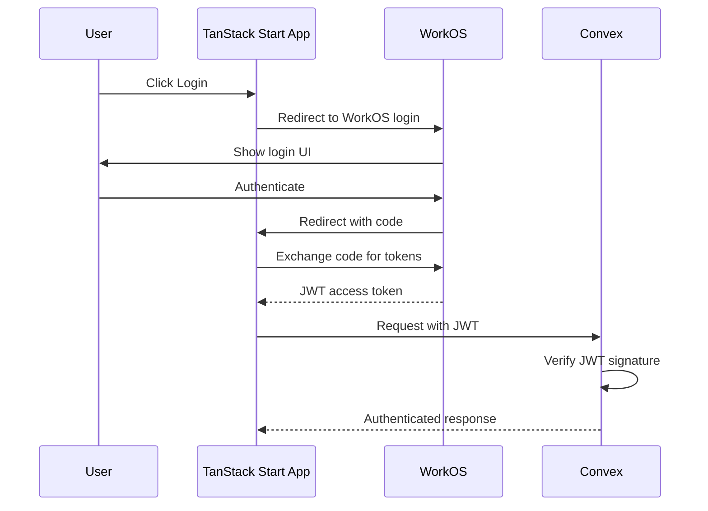

# 2.3 Auth Integration

## Overview

Integrate WorkOS authentication with Convex. This is entirely r9stack-provided integration code—there's no CLI for this. WorkOS handles the authentication flow and issues JWTs; Convex verifies those JWTs.

## Key Decisions

| Decision | Choice | Rationale |
|----------|--------|-----------|
| WorkOS Product | **AuthKit** | Hosted login UI, simplest integration, handles email/password + social logins |
| Token Storage | **httpOnly cookies** | Secure (no JS access), SSR-compatible (cookies sent automatically) |
| Convex Auth | **Server-side token extraction** | Enables standard `ctx.auth.getUserIdentity()` pattern in all queries/mutations |
| Protected Routes | **Server-side redirect** | Auth cookie available during SSR; cleaner UX without loading flicker |

## Authentication Flow



---

## 2.3.1 WorkOS AuthKit Setup

**Goal:** Install and configure WorkOS AuthKit for hosted authentication.

**Dependencies:**
```bash
npm install @workos-inc/node
```

**Environment variables needed:**
```
WORKOS_API_KEY=sk_...
WORKOS_CLIENT_ID=client_...
WORKOS_COOKIE_PASSWORD=<32+ character secret for cookie encryption>
WORKOS_REDIRECT_URI=http://localhost:3000/auth/callback
```

**AuthKit provides:**
- Hosted login UI (no need to build login forms)
- Email/password authentication
- Social login providers (Google, GitHub, etc.)
- Session management with refresh tokens

**Status:** 🔵 Planned

---

## 2.3.2 Convex Auth Configuration

**Goal:** Configure Convex to verify WorkOS JWTs using server-side token extraction.

**Approach:** 
1. TanStack Start reads the session cookie server-side
2. Extracts/refreshes the JWT from the WorkOS session
3. Passes the JWT to `ConvexProviderWithAuth` on the client
4. Convex verifies the JWT signature against WorkOS JWKS endpoint

**Files to create/modify:**
```
convex/
├── auth.config.ts       # Auth provider configuration (JWKS endpoint)
└── auth.ts              # Auth helper functions
lib/
└── auth.server.ts       # Server-side token extraction
app/routes/
└── __root.tsx           # ConvexProviderWithAuth with token fetcher
```

**Server-side token extraction pattern:**
```typescript
// lib/auth.server.ts
export async function getConvexToken(request: Request): Promise<string | null> {
  const session = await getSession(request); // reads httpOnly cookie
  if (!session) return null;
  return session.accessToken; // JWT for Convex
}
```

**Client-side provider pattern:**
```typescript
// In __root.tsx or provider wrapper
<ConvexProviderWithAuth
  client={convex}
  useAuth={() => ({
    isLoading: false,
    isAuthenticated: !!token,
    fetchAccessToken: async () => token, // passed from server
  })}
>
```

**Status:** 🔵 Planned

---

## 2.3.3 Login Flow Implementation

**Goal:** Implement the complete login flow using AuthKit.

**Files to create:**
```
app/routes/
├── login.tsx            # Redirects to AuthKit hosted login
└── auth/
    └── callback.tsx     # Handles AuthKit callback
lib/
└── auth.server.ts       # Server-side auth utilities
```

**Steps:**
- Login page redirects to AuthKit authorization URL
- Callback route exchanges code for session tokens
- Store session in httpOnly cookie (encrypted with WORKOS_COOKIE_PASSWORD)
- Redirect to intended destination after login

**AuthKit integration pattern:**
```typescript
// lib/auth.server.ts
import { WorkOS } from '@workos-inc/node';

const workos = new WorkOS(process.env.WORKOS_API_KEY);

export async function getAuthorizationUrl(redirectUri: string) {
  return workos.userManagement.getAuthorizationUrl({
    clientId: process.env.WORKOS_CLIENT_ID,
    redirectUri,
    provider: 'authkit',
  });
}
```

**Status:** 🔵 Planned

---

## 2.3.4 Logout Implementation

**Goal:** Implement secure logout.

**Steps:**
- Clear local tokens/session
- Optionally revoke WorkOS session
- Redirect to home or login page

**Status:** 🔵 Planned

---

## 2.3.5 Protected Routes

**Goal:** Create route protection for authenticated pages with server-side redirect.

**Files to create:**
```
lib/
└── auth.server.ts           # Server-side session check (extended)
app/routes/
└── dashboard/
    └── __layout.tsx         # Layout with auth guard for dashboard routes
```

**Behavior (server-side redirect):**
- Check session cookie during SSR (before page renders)
- If not authenticated, redirect to `/login` immediately on the server
- Preserve intended destination in query param for post-login redirect
- No loading state needed—unauthenticated users never see protected content

**TanStack Start integration:**
```typescript
// In route loader or layout
import { redirect } from '@tanstack/react-router';
import { getSession } from '~/lib/auth.server';

export const beforeLoad = async ({ context }) => {
  const session = await getSession(context.request);
  if (!session) {
    throw redirect({ to: '/login', search: { redirect: context.location.href } });
  }
  return { session };
};
```

**Status:** 🔵 Planned

---

## 2.3.6 User Context

**Goal:** Provide current user information throughout the app.

**Files to create:**
```
lib/
└── hooks/
    └── use-current-user.ts  # Hook to get current user
```

**Features:**
- Fetch user data from Convex using authenticated identity
- Cache user data appropriately
- Handle loading and error states
- Provide user info to components (avatar, name, email)

**Status:** 🔵 Planned

---

## 2.3.7 User Sync

**Goal:** Sync WorkOS user data to Convex on first login.

**Convex mutation to create:**
```typescript
// convex/users.ts
export const syncUser = mutation({
  args: {},
  handler: async (ctx) => {
    const identity = await ctx.auth.getUserIdentity();
    // Create or update user record from WorkOS claims
  },
});
```

**Status:** 🔵 Planned
