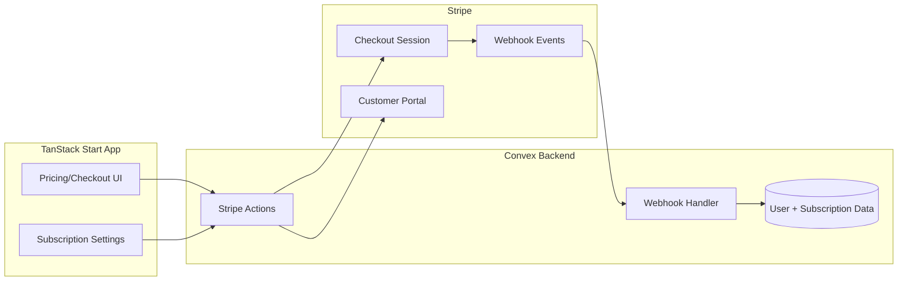

# 2.4 Payments Integration

> **Note:** This task group is **deferred to post-V1**. V1 focuses on the core stack (TanStack Start + Convex + WorkOS auth). Payments integration will be added in a future version.

## Overview

Integrate Stripe for payment processing. This is entirely r9stack-provided integration code. Stripe handles payment flows; Convex stores subscription state and handles webhooks.

## Payment Architecture



---

## 2.4.1 Stripe SDK Setup

**Goal:** Install and configure the Stripe SDK.

**Dependencies:**
```bash
npm install stripe
```

**Environment variables needed:**
```
STRIPE_SECRET_KEY=sk_test_...
STRIPE_WEBHOOK_SECRET=whsec_...
STRIPE_PRICE_ID_BASIC=price_...
STRIPE_PRICE_ID_PRO=price_...
```

**Status:** 🔵 Planned

---

## 2.4.2 Customer Management

**Goal:** Create and link Stripe customers to Convex users.

**Convex action to create:**
```typescript
// convex/stripe.ts
export const createCustomer = action({
  args: {},
  handler: async (ctx) => {
    // Get current user
    // Create Stripe customer
    // Store stripeCustomerId in user record
  },
});
```

**When to create customer:**
- On first checkout attempt
- Or proactively after user registration

**Status:** 🔵 Planned

---

## 2.4.3 Checkout Flow

**Goal:** Implement Stripe Checkout for subscription signup.

**Convex action to create:**
```typescript
// convex/stripe.ts
export const createCheckoutSession = action({
  args: { priceId: v.string() },
  handler: async (ctx, args) => {
    // Create Stripe Checkout session
    // Return session URL for redirect
  },
});
```

**Frontend flow:**
1. User clicks "Subscribe" on pricing page
2. Call createCheckoutSession action
3. Redirect to Stripe Checkout URL
4. Stripe redirects back on success/cancel

**Status:** 🔵 Planned

---

## 2.4.4 Webhook Handler

**Goal:** Process Stripe webhook events in Convex.

**Files to create:**
```
convex/
└── http.ts              # HTTP routes including webhook endpoint
```

**Events to handle:**
- `checkout.session.completed` - Initial subscription
- `customer.subscription.updated` - Plan changes
- `customer.subscription.deleted` - Cancellation
- `invoice.payment_failed` - Payment issues

**Security:**
- Verify webhook signature using STRIPE_WEBHOOK_SECRET
- Use Convex HTTP actions for webhook endpoint

**Status:** 🔵 Planned

---

## 2.4.5 Subscription State

**Goal:** Track subscription status in Convex.

**Schema additions (in users table):**
```typescript
stripeCustomerId: v.optional(v.string()),
subscriptionId: v.optional(v.string()),
subscriptionStatus: v.optional(v.string()), // active, canceled, past_due
subscriptionTier: v.optional(v.string()),   // basic, pro
currentPeriodEnd: v.optional(v.number()),
```

**Queries to create:**
```typescript
// convex/users.ts
export const getSubscriptionStatus = query({...});
export const hasActiveSubscription = query({...});
```

**Status:** 🔵 Planned

---

## 2.4.6 Customer Portal

**Goal:** Allow users to manage their subscription.

**Convex action to create:**
```typescript
// convex/stripe.ts
export const createPortalSession = action({
  args: {},
  handler: async (ctx) => {
    // Create Stripe Customer Portal session
    // Return portal URL for redirect
  },
});
```

**Frontend integration:**
- "Manage Subscription" button in settings
- Redirects to Stripe-hosted portal
- User can update payment, cancel, change plan

**Status:** 🔵 Planned

---

## 2.4.7 Feature Gating

**Goal:** Gate features based on subscription status.

**Patterns to implement:**
```typescript
// lib/hooks/use-subscription.ts
export function useSubscription() {
  // Return subscription status, tier, helpers
}

// Usage in components
const { isActive, tier, canAccess } = useSubscription();
if (!canAccess('pro-feature')) {
  return <UpgradePrompt />;
}
```

**Status:** 🔵 Planned
