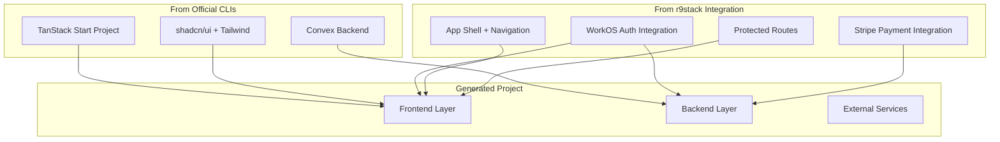

# Area 2: Project Scaffold

## Overview

This area defines the **target state** of a generated r9stack project—what should exist after `r9stack init` completes. Since we use a script-first approach (executing official CLIs), this area specifies what the CLIs produce plus what integration code we add on top.

## Goals

- Specify the expected structure and features of generated projects
- Define integration patterns that connect the technologies
- Document what each official CLI contributes to the project
- Specify the custom integration code r9stack adds

## Architecture

## Task Groups

| ID | Name | Description | Status |
|----|------|-------------|--------|
| 2.1 | [Frontend Foundation](2.1-frontend-foundation.md) | What TanStack Start + shadcn provide, plus app shell | 🔵 Planned |
| 2.2 | [Backend Setup](2.2-backend-setup.md) | What Convex CLI provides, plus schema patterns | 🔵 Planned |
| 2.3 | [Auth Integration](2.3-auth-integration.md) | WorkOS + Convex JWT integration (r9stack adds) | 🔵 Planned |
| 2.4 | [Payments Integration](2.4-payments-integration.md) | Stripe + Convex integration (r9stack adds) | ⏳ Post-V1 |
| 2.5 | [Dev Environment](2.5-dev-environment.md) | Scripts, env templates, setup instructions | 🔵 Planned |

> **V1 Scope:** Tasks 2.1–2.3 and 2.5 are in scope for V1. Payments (2.4) is deferred to a future version.

## What Comes From Where

| Component | Source | r9stack Responsibility | Version |
|-----------|--------|----------------------|---------|
| React + Routing | TanStack Start CLI | Execute CLI with correct flags | V1 |
| Tailwind CSS | shadcn CLI | Execute CLI with correct flags | V1 |
| UI Components | shadcn CLI | Execute CLI, may add specific components | V1 |
| Convex Backend | Convex CLI | Execute CLI, add schema extensions | V1 |
| WorkOS Auth | r9stack integration | Full integration templates | V1 |
| App Shell | r9stack integration | Navigation, layout, user menu | V1 |
| Protected Routes | r9stack integration | Auth guards, redirects | V1 |
| Stripe Payments | r9stack integration | Full integration templates | Post-V1 |

## Key Decisions

- **TanStack Start** for the frontend (React with file-based routing)
- **Convex** as the backend and database (real-time, serverless)
- **WorkOS** for authentication (enterprise-ready, custom JWT integration with Convex)
- **Stripe** for payments (industry standard, good DX)
- **shadcn/ui** for components (accessible, customizable, Tailwind-based)
- **Built-in versioning** following the flight-rules pattern for project version tracking
