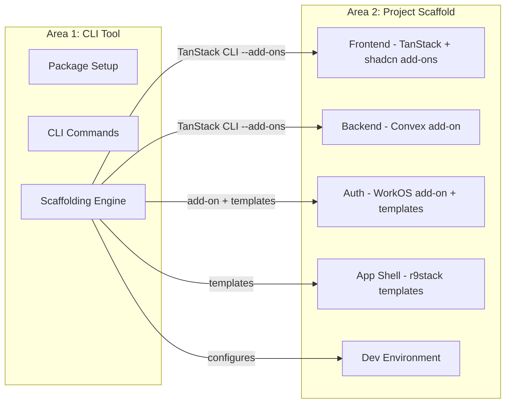

# Implementation Overview

This document lists the major implementation areas for r9stack.

## Implementation Approach

r9stack uses a **command-first approach**: leverage TanStack Start's add-on system to scaffold as much as possible with a single command, then apply minimal integration templates only for gaps.

### Initialization Order (V1)

```
1. TanStack Start CLI with add-ons  →  Complete base scaffold
   - --add-ons shadcn,convex,workos
   - Includes Tailwind CSS, routing, backend
2. Gap analysis                     →  Compare against target output
3. r9stack templates                →  App shell, protected routes, integration glue
4. Post-scaffold                    →  Additional dependencies (iron-session), configuration
```

> **V1 Scope:** Payments (Stripe) integration is deferred to post-V1.

> **Command-First Philosophy:** Prefer TanStack Start add-ons over manual CLI orchestration. The sandbox project (r9teststack) was built manually to understand the target output; actual CLI implementation should use add-ons and supplement with templates only where needed.

## Version Matrix (Validated)

| Package | Version | Notes |
|---------|---------|-------|
| React | 19.x | Latest with concurrent features |
| TanStack Start | 1.132.x | Full-stack React framework |
| Tailwind CSS | 4.x | New CSS-first configuration |
| shadcn/ui | 3.x | With Tailwind v4 support |
| Convex | 1.31.x | Real-time backend |
| WorkOS Node SDK | 7.x | Authentication |
| iron-session | 8.x | Encrypted cookie sessions |
| Vite | 7.x | Build tool |
| TypeScript | 5.7.x | Type checking |

## Implementation Areas

1. **CLI Tool** – The r9stack npm package, CLI orchestration, and scaffolding engine
   - Status: 🟡 In Progress
   - See: [`1-cli-tool/`](1-cli-tool/)

2. **Project Scaffold** – Target state specification of a generated r9stack project
   - Status: 🟡 In Progress
   - See: [`2-project-scaffold/`](2-project-scaffold/)

## Architecture Overview



## What Comes From Where

| Component | Primary Source | r9stack Adds | Version |
|-----------|---------------|--------------|---------|
| React + File-based Routing | TanStack Start CLI | — | V1 |
| Tailwind CSS + UI Components | `--add-ons shadcn` | — | V1 |
| Backend + Database | `--add-ons convex` | Demo schema | V1 |
| Authentication Base | `--add-ons workos` | — | V1 |
| Session Management | r9stack templates | iron-session integration | V1 |
| App Shell + Navigation | r9stack templates | AppShell, Sidebar, UserMenu | V1 |
| Protected Routes | r9stack templates | Auth guard in `/app/route.tsx` | V1 |
| Payments | r9stack templates | Stripe + Convex integration | Post-V1 |

> **Note:** The exact split between add-on output and r9stack templates will be determined by comparing add-on output against the validated target (see `tmp/r9teststack`).

## Reference: Target Output

The `tmp/r9teststack` sandbox documents the validated target output structure. Key patterns:

- **Route structure:** `/` public, `/auth/*` auth flow, `/app/*` protected
- **Auth files:** `auth.ts` (types), `auth-client.ts` (context), `auth-server.ts` (iron-session)
- **App shell:** Collapsible sidebar with NavGroup, NavItem, UserMenu components
- **Providers:** AuthProvider wraps ConvexClientProvider in root layout

## How to Use This

1. Each numbered area has its own directory: `{N}-{kebab-topic}/`
2. Inside each directory:
   - `index.md` – Overview and goals for that area
   - `{N}.{M}-topic.md` – Task Groups with detailed tasks
3. Status is tracked at the Task level within Task Group files
4. Tasks are refined at the start of coding sessions, not all upfront
