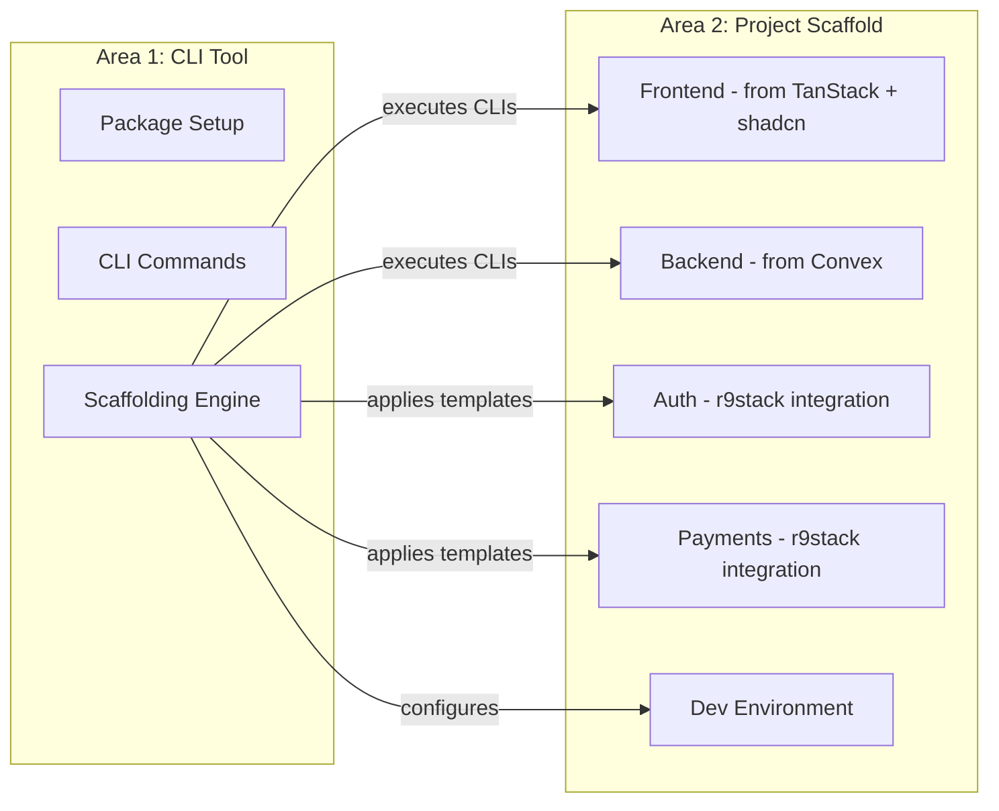

# Implementation Overview

This document lists the major implementation areas for r9stack.

## Implementation Approach

r9stack uses a **script-first approach**: execute official CLI tools (TanStack Start, shadcn/ui, Convex) in sequence, then apply minimal integration templates for the glue code that connects them.

### Initialization Order (V1)

```
1. TanStack Start CLI  →  Base React project with routing
2. shadcn/ui CLI       →  Tailwind CSS + component library  
3. Convex CLI          →  Backend and database layer
4. r9stack templates   →  Auth (WorkOS) integration
5. Post-scaffold       →  Wire everything together
```

> **V1 Scope:** Payments (Stripe) integration is deferred to post-V1.

## Implementation Areas

1. **CLI Tool** – The r9stack npm package, CLI orchestration, and scaffolding engine
   - Status: 🔵 Planned
   - See: [`1-cli-tool/`](1-cli-tool/)

2. **Project Scaffold** – Target state specification of a generated r9stack project
   - Status: 🔵 Planned
   - See: [`2-project-scaffold/`](2-project-scaffold/)

## Architecture Overview



## What Comes From Where

| Component | Source | Notes | Version |
|-----------|--------|-------|---------|
| React + File-based Routing | TanStack Start CLI | `npm create @tanstack/start@latest` | V1 |
| Tailwind CSS + UI Components | shadcn/ui CLI | `npx shadcn@latest init` | V1 |
| Backend + Database | Convex CLI | `npx convex init` | V1 |
| Authentication | r9stack templates | WorkOS + Convex JWT integration | V1 |
| App Shell + Navigation | r9stack templates | Header, user menu, protected routes | V1 |
| Payments | r9stack templates | Stripe + Convex integration | Post-V1 |

## How to Use This

1. Each numbered area has its own directory: `{N}-{kebab-topic}/`
2. Inside each directory:
   - `index.md` – Overview and goals for that area
   - `{N}.{M}-topic.md` – Task Groups with detailed tasks
3. Status is tracked at the Task level within Task Group files
4. Tasks are refined at the start of coding sessions, not all upfront
