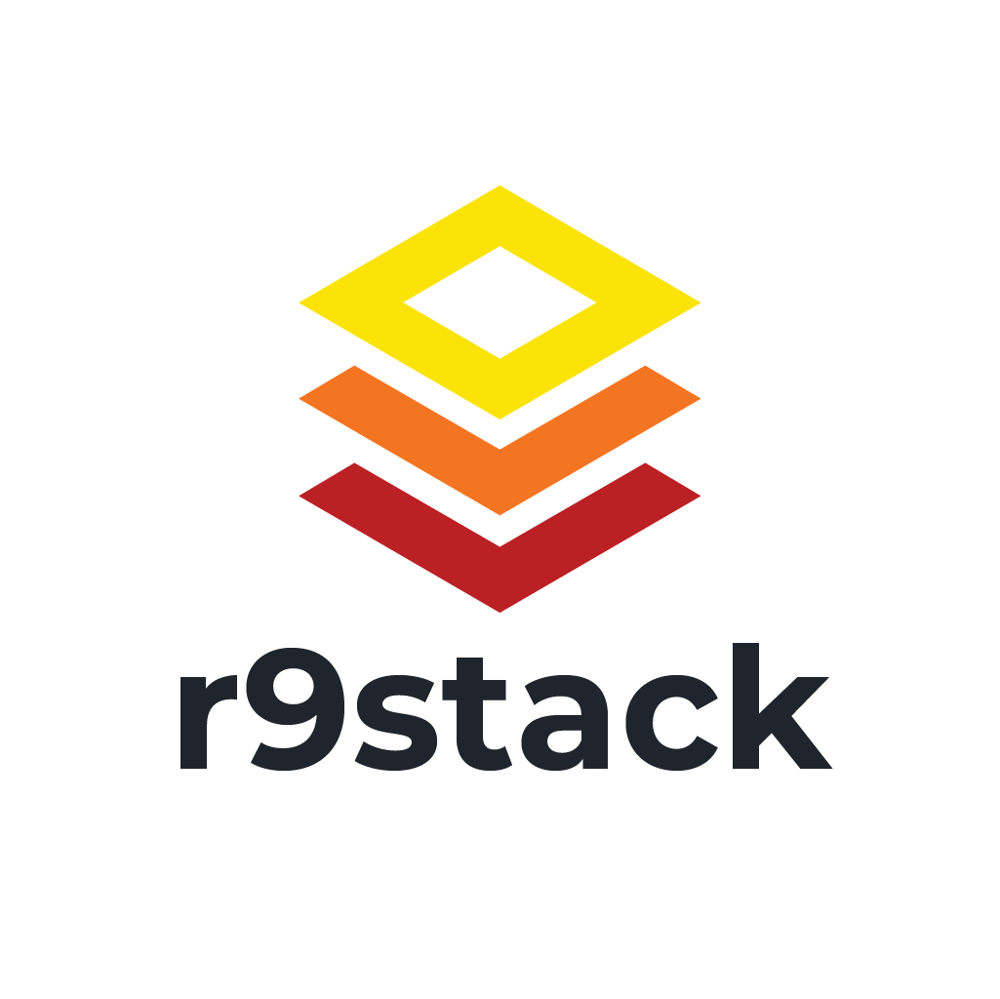

<p align="center">
  
</p>

<p align="center">
  A CLI that scaffolds opinionated SaaS projects with a fully functional walking skeleton—a complete frontend, backend, and database stack with auth pre-integrated.
</p>

## Status

🚀 **Available on npm** - Install with `npx r9stack@dev`

| Feature | Status |
|---------|--------|
| TanStack Start + React 19 | ✅ Working |
| Template-based architecture | ✅ Working |
| shadcn/ui + Tailwind CSS | ✅ Working |
| Convex backend | ✅ Working |
| WorkOS auth | ✅ Working |
| Flight Rules docs | ✅ Working |
| GitHub repo creation | ✅ Working |
| Vercel deployment | 📋 Planned |
| Stripe payments | 📋 Post-V1 |

## Why r9stack?

Agentic coding has dramatically accelerated feature development, but initial project setup—configuring the frontend framework, wiring up the backend and database, integrating auth providers—remains tedious and error-prone.

r9stack eliminates this friction. Run a single command and have a scaffolded full-stack project in minutes.

## Architecture

r9stack uses TanStack Start's [template system](docs/tanstack-start-starter-system.md) to create projects:

1. **CLI invokes TanStack Start** with a `--template` flag pointing to a hosted `template.json`
2. **TanStack Start creates the project** and applies r9stack customizations
3. **CLI guides post-creation setup** for Convex, WorkOS, and optional GitHub/Vercel integration

## Tech Stack

| Layer | Technology | Description |
|-------|------------|-------------|
| Framework | TanStack Start | Full-stack React framework with SSR and server functions |
| UI Library | React 19 | Declarative UI with the latest React features |
| Language | TypeScript | Type-safe JavaScript for reliable code |
| Styling | Tailwind CSS 4 | Utility-first CSS framework |
| Build | Vite | Lightning-fast build tool and dev server |
| Backend | Convex | Real-time backend with automatic sync |
| Auth | WorkOS AuthKit | Enterprise-ready SSO and MFA |
| Sessions | iron-session | Encrypted cookie-based sessions |
| Components | shadcn/ui | Beautiful, accessible Radix-based components |

## Getting Started

```bash
# Create a new project
npx r9stack@dev init my-project
```

### Local Development

```bash
# Clone the repository
git clone https://github.com/ryanpacker/r9stack.git
cd r9stack

# Install dependencies and build
npm install
npm run build

# Link globally for testing
npm link

# Create a new project
r9stack init my-project
```

## Usage

```bash
# Interactive mode - prompts for project name and options
npx r9stack@dev init

# Provide project name directly
npx r9stack@dev init my-awesome-app

# Non-interactive with defaults (installs Flight Rules, skips GitHub)
npx r9stack@dev init my-awesome-app --yes

# Create with GitHub repo
npx r9stack@dev init my-awesome-app --yes --github

# Create public GitHub repo
npx r9stack@dev init my-awesome-app --github --public

# Skip Flight Rules installation
npx r9stack@dev init my-awesome-app --no-flight-rules

# Use a specific template
npx r9stack@dev init my-awesome-app --template standard

# List available templates
npx r9stack@dev --template-list

# View help
npx r9stack@dev init --help
```

### CLI Options

| Flag | Description |
|------|-------------|
| `-y, --yes` | Skip confirmation prompts |
| `-t, --template <id>` | Use a specific template (e.g., 'standard') |
| `--no-flight-rules` | Skip Flight Rules installation |
| `--github` | Create GitHub repository |
| `--no-github` | Skip GitHub repository creation |
| `--private` | Make GitHub repository private (default) |
| `--public` | Make GitHub repository public |

The CLI will:
1. Fetch the latest template from GitHub
2. Create your project using TanStack Start
3. Replace project name placeholders in generated files
4. Install [Flight Rules](https://github.com/ryanpacker/flight-rules) documentation framework
5. Optionally create a GitHub repository and push initial commit
6. Guide you through post-creation setup (Convex, WorkOS)

## What Gets Generated (V1 Target)

Running `npx r9stack@dev init` will create a project with:

```
my-project/
├── .flight-rules/          # Flight Rules documentation framework
│   ├── AGENTS.md           # Agent guidelines
│   ├── commands/           # Coding session workflows
│   └── doc-templates/      # Documentation templates
├── convex/
│   ├── _generated/         # Auto-generated by Convex
│   ├── schema.ts           # Database schema
│   └── messages.ts         # Demo Convex functions
├── public/
│   └── images/             # App logos and assets
├── src/
│   ├── components/
│   │   ├── ui/             # shadcn components
│   │   ├── AppShell.tsx    # Application shell
│   │   ├── Sidebar.tsx     # Collapsible sidebar
│   │   ├── NavGroup.tsx    # Navigation group
│   │   ├── NavItem.tsx     # Navigation item
│   │   └── UserMenu.tsx    # Auth-aware user menu
│   ├── lib/
│   │   ├── auth.ts         # Auth types
│   │   ├── auth-client.ts  # Client-side auth context
│   │   ├── auth-server.ts  # Server-side auth (iron-session)
│   │   └── utils.ts        # Utilities (cn helper)
│   ├── routes/
│   │   ├── __root.tsx      # Root layout with providers
│   │   ├── index.tsx       # Public landing page
│   │   ├── auth/           # Auth flow routes
│   │   │   ├── sign-in.tsx
│   │   │   ├── callback.tsx
│   │   │   └── sign-out.tsx
│   │   └── app/            # Protected routes
│   │       ├── route.tsx   # Auth guard + AppShell
│   │       ├── index.tsx   # Authenticated home
│   │       └── demo/       # Demo pages
│   └── styles.css          # Tailwind + shadcn styles
├── .env.example
├── components.json         # shadcn configuration
├── package.json
├── tsconfig.json
└── vite.config.ts
```

### Route Structure

- `/` — Public landing page
- `/auth/*` — Authentication flow (sign-in, callback, sign-out)
- `/app/*` — Protected routes (requires authentication)

## Manual Setup Required

After scaffolding, you'll need to:

1. **Set up WorkOS** — Create account at https://workos.com, configure redirect URI
2. **Set up Convex** — Run `npx convex dev` to create project and authenticate
3. **Add environment variables** — Copy `.env.example` to `.env.local` and fill in credentials

## Project Structure

```
r9stack/
├── src/                    # CLI source code
├── templates/
│   ├── standard/           # r9-template-standard source
│   └── auth/               # r9-template-auth source
├── tests/
│   ├── e2e/               # End-to-end tests
│   └── output/            # Test output (gitignored)
├── docs/
│   ├── prd.md             # Product requirements
│   ├── implementation/    # Implementation specs
│   └── ...
└── dist/                  # Compiled CLI
```

## Documentation

- [Product Requirements](docs/prd.md)
- [TanStack Start Template System](docs/tanstack-start-starter-system.md)
- [Template Development Guide](docs/template-development.md)
- [Tech Stack](docs/tech-stack.md)

## License

Apache 2.0 - See [LICENSE](LICENSE) for details.
